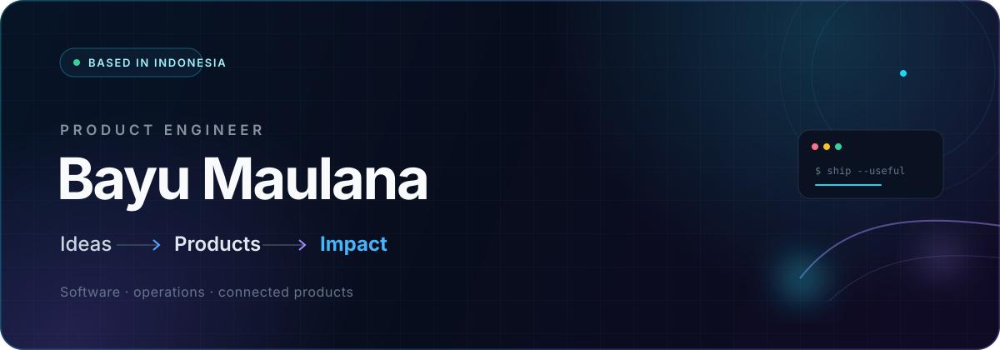

  

  <a href="https://www.linkedin.com/in/ba-yu-maulana/"><strong>LinkedIn ↗</strong></a>
  &nbsp;&nbsp;·&nbsp;&nbsp;
  <a href="https://www.youtube.com/@bayuzzs"><strong>YouTube ↗</strong></a>

## Hello — I'm Bayu.

I'm a product engineer based in Batam, Indonesia. I build where software, operations, and physical products meet—taking ideas from a rough brief through architecture, user experience, delivery, and the unglamorous last mile that makes a product actually work.

I care about simple systems, thoughtful interfaces, and technology that earns its place.

## Selected work

<table>
  <tr>
    <td width="33%" valign="top">
      <h3><a href="https://snaptix.id">Snaptix ↗</a></h3>
      
Digital ticketing infrastructure for events—from commerce and organizer workflows to resilient venue validation.

      
<code>EVENTS</code> <code>COMMERCE</code> <code>OPERATIONS</code>

    </td>
    <td width="33%" valign="top">
      <h3><a href="https://makeable.build">Makeable ↗</a></h3>
      
A platform for turning connected-product ideas into things people can build, flash, and use.

      
<code>HARDWARE</code> <code>ESP32</code> <code>WEB SERIAL</code>

    </td>
    <td width="33%" valign="top">
      <h3>Infina</h3>
      
A technology studio shipping focused digital systems for businesses, operations teams, and public-facing experiences.

      
<code>PRODUCT</code> <code>WEB</code> <code>CLIENT SYSTEMS</code>

    </td>
  </tr>
</table>

## How I build

- **Start with the real constraint.** Users, operations, and edge cases shape the product before the stack does.
- **Own the whole journey.** Interface, backend, deployment, and field reliability belong to the same experience.
- **Keep learning in public.** I explore product engineering, AI, connected hardware, and better ways to ship.

## Toolbox

| Product interfaces | Services & systems | Data & delivery |
| --- | --- | --- |
| `TypeScript` · `React` · `Next.js` · `Flutter` · `Redux` · `HTML` · `CSS` | `Node.js` · `NestJS` · `Express` · `Go` · `Python` | `MySQL` · `Redis` · `Git` |

## Open-source signal

  
  

Public repositories only. Language totals describe code composition, not skill level.

---

<h2 align="center">Let's build something useful.</h2>

  Have a hard product problem? Let's turn it into something people can use. 
  <a href="https://www.linkedin.com/in/ba-yu-maulana/"><strong>Start a conversation ↗</strong></a>

