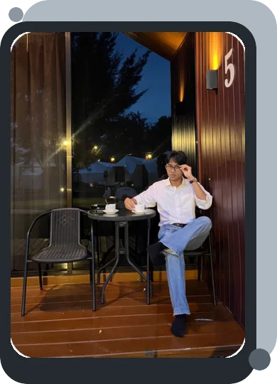

  <picture>
    <source media="(prefers-color-scheme: dark)" srcset="https://capsule-render.vercel.app/api?type=waving&amp;color=0:21262D%2C50:57606A%2C100:AFB8C1&amp;height=90&amp;section=header" />
    <source media="(prefers-color-scheme: light)" srcset="https://capsule-render.vercel.app/api?type=waving&amp;color=0:D0D7DE%2C50:8C959F%2C100:57606A&amp;height=90&amp;section=header" />
    
  </picture>

  
  <picture>
    <source media="(prefers-color-scheme: dark)" srcset="https://readme-typing-svg.demolab.com?font=Space+Mono&amp;weight=700&amp;size=28&amp;pause=900&amp;color=C9D1D9&amp;center=true&amp;vCenter=true&amp;width=650&amp;lines=yo%2C+I%27m+Bayu+%F0%9F%91%BE;software+engineer+%2B+product+builder;one+shot+americano+%E2%86%92+shipped+product" />
    <source media="(prefers-color-scheme: light)" srcset="https://readme-typing-svg.demolab.com?font=Space+Mono&amp;weight=700&amp;size=28&amp;pause=900&amp;color=57606A&amp;center=true&amp;vCenter=true&amp;width=650&amp;lines=yo%2C+I%27m+Bayu+%F0%9F%91%BE;software+engineer+%2B+product+builder;one+shot+americano+%E2%86%92+shipped+product" />
    
  </picture>
    
  <pre>
💼 co-founder @ Snaptix.id
🎟 event-tech + payments
🛠 product + code + ops
📍 Batam, Indonesia
☕ americano → ship</pre>
   
  
  
  
  

 

## quick lore dump 🧃

i build products that have to work outside the demo tab—ticketing, payments, check-in, dashboards, deployments, and the occasional event-day fire.

- co-founder at **[Snaptix.id](https://snaptix.id)**, built with a team across **50K+ transactions**, **15+ events**, and **8 payment integrations**
- software engineer working across product, frontend, backend, deployment, and event-day operations
- somehow also a coding educator, Linux community lead, and software engineering student
- my favorite stack is the one that gets the useful thing shipped

## stuff with lore ✦

- 🎟 **[Snaptix ↗](https://snaptix.id)** — event ticketing that survives real crowds, real money, and real deadlines
- 🧠 **[Bangkit ↗](https://github.com/bayuzzs/kmipn-bangkit)** — CBT + community recovery app; **2nd overall at KMIPN VII**
- 🀄 **[Hanzi Play ↗](https://hanzi-play.vercel.app)** — a gamified HSK 1–7 Mandarin learning experiment

## things i make computers do stuff with 🎒

  <picture>
    <source media="(prefers-color-scheme: dark)" srcset="https://skillicons.dev/icons?i=ts%2Creact%2Cnextjs%2Ctailwind%2Cnodejs%2Cnestjs%2Cgo%2Claravel%2Cpostgres%2Cmysql%2Cmongodb%2Credis%2Cdocker%2Clinux&amp;perline=7&amp;theme=dark" />
    <source media="(prefers-color-scheme: light)" srcset="https://skillicons.dev/icons?i=ts%2Creact%2Cnextjs%2Ctailwind%2Cnodejs%2Cnestjs%2Cgo%2Claravel%2Cpostgres%2Cmysql%2Cmongodb%2Credis%2Cdocker%2Clinux&amp;perline=7&amp;theme=light" />
    
  </picture>

  
<strong>tiny trophy shelf because why not 🏆</strong>

   

- 🥇 1st place — National Coder Competition 2024
- 🥈 2nd overall — KMIPN VII 2025
- 🏥 finalist among 1,000+ teams — BPJS Healthkathon 2024
- 🎤 speaker — Temunitas × IDCloudhost 2025
- 🐧 general chairman — Batam Linux User Group 2025

## github being github 📊

  <picture>
    <source media="(prefers-color-scheme: dark)" srcset="https://github-profile-summary-cards.vercel.app/api/cards/profile-details?username=bayuzzs&amp;theme=github_dark" />
    <source media="(prefers-color-scheme: light)" srcset="https://github-profile-summary-cards.vercel.app/api/cards/profile-details?username=bayuzzs&amp;theme=github" />
    
  </picture>

plot twist: a lot of the production code lives in private and organization-owned repositories.

---

  <samp>if it's hard, weird, or useful—i probably want to build it.</samp>  
  <a href="mailto:ba.yu.maulana@outlook.com"><strong>let's make something cool ↗</strong></a>

  <picture>
    <source media="(prefers-color-scheme: dark)" srcset="https://capsule-render.vercel.app/api?type=waving&amp;color=0:AFB8C1%2C50:57606A%2C100:21262D&amp;height=90&amp;section=footer" />
    <source media="(prefers-color-scheme: light)" srcset="https://capsule-render.vercel.app/api?type=waving&amp;color=0:57606A%2C50:8C959F%2C100:D0D7DE&amp;height=90&amp;section=footer" />
    
  </picture>

