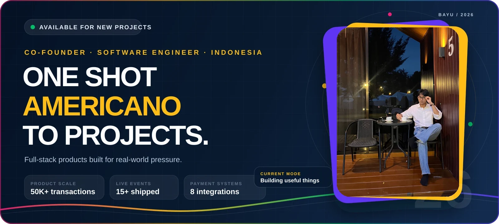
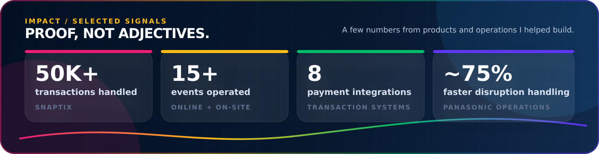
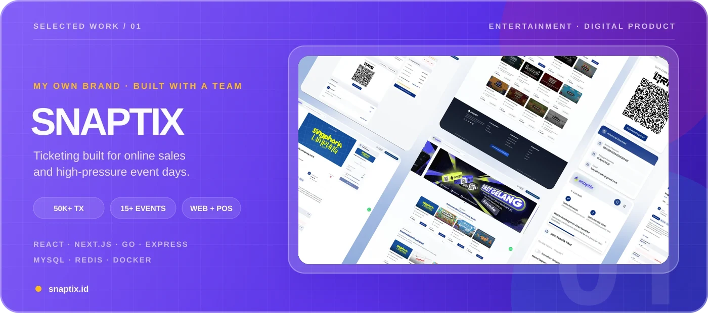
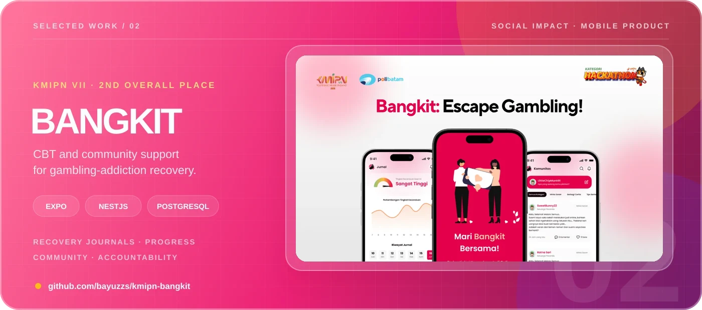
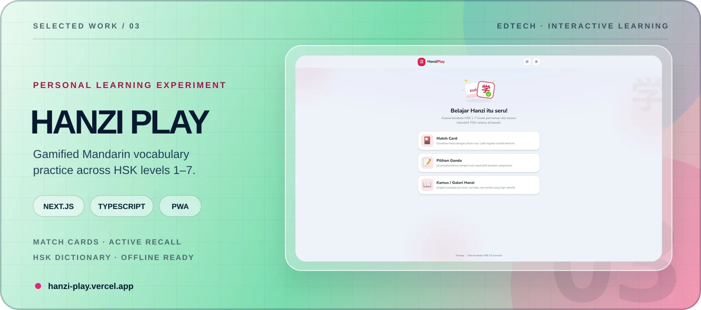
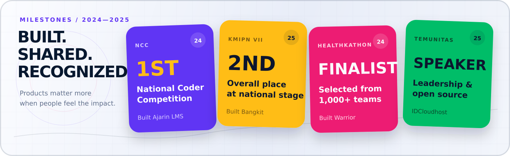

  

  <a href="https://bayumaulana.my.id"><strong>Website</strong></a>
  &nbsp;·&nbsp;
  <a href="mailto:ba.yu.maulana@outlook.com"><strong>Email</strong></a>
  &nbsp;·&nbsp;
  <a href="https://linkedin.com/in/ba-yu-maulana"><strong>LinkedIn</strong></a>
  &nbsp;·&nbsp;
  <a href="https://instagram.com/bayuzzs"><strong>Instagram</strong></a>
  &nbsp;·&nbsp;
  <a href="https://bayumaulana.my.id/cv-bayu-maulana.pdf"><strong>Résumé</strong></a>

## I build past the happy path.

I'm Bayu, a software engineer and co-founder at **PT. Sky Multi Creative**. I work across product, frontend, backend, payments, deployment, and event-day operations—because useful software has to survive more than a demo.

My sweet spot is turning complex technical problems into experiences that feel clear, fast, and dependable.

  

## Selected work

Real products, real constraints, and lessons that only appear after shipping.

**Snaptix** is my event-ticketing brand, built with a team for digital commerce and real event-day operations. It supports ticket sales, POS, check-in, promotions, reporting, and flexible fee flows across a microservices-oriented platform.

**[Visit Snaptix ↗](https://snaptix.id)**
&nbsp; <code>React</code> <code>Next.js</code> <code>Go</code> <code>Express</code> <code>MySQL</code> <code>Redis</code> <code>Docker</code>

 

**Bangkit** combines CBT-based recovery flows with community support to help people break online-gambling addiction. We built and presented the final product at KMIPN VII, securing **second overall place** at the national stage.

**[View the repository ↗](https://github.com/bayuzzs/kmipn-bangkit)**
&nbsp; <code>Expo</code> <code>NativeWind</code> <code>NestJS</code> <code>PostgreSQL</code> <code>Docker</code>

 

**Hanzi Play** is a personal learning experiment for memorizing HSK 1–7 vocabulary through match cards, active-recall quizzes, a searchable dictionary, bookmarks, and an installable offline-ready experience.

**[Try Hanzi Play ↗](https://hanzi-play.vercel.app)**
&nbsp; <code>Next.js</code> <code>React</code> <code>TypeScript</code> <code>Tailwind CSS</code> <code>PWA</code>

## Milestones

  

## Beyond the commit

- **2025—Now · Co-Founder & Software Engineer** — Building full-stack event platforms at PT. Sky Multi Creative.
- **2025 · General Chairman, Batam Linux User Group** — Led city-to-national programs and grew recruitment and cadre development by **3×**.
- **2023—2025 · Coding educator** — Taught programming, web, and mobile development through Superprof and SMK Negeri 5 Batam.
- **2023—Now · Software Engineering student** — Pursuing D4 TRPL at Politeknik Negeri Batam.

## Systems I reach for

**Interfaces** — <code>TypeScript</code> <code>React</code> <code>Next.js</code> <code>Tailwind CSS</code> <code>React Native</code> <code>Flutter</code> 
**Services** — <code>NestJS</code> <code>Express</code> <code>Go</code> <code>Laravel</code> 
**Data** — <code>MySQL</code> <code>PostgreSQL</code> <code>MongoDB</code> <code>Redis</code> 
**Delivery** — <code>Docker</code> <code>Podman</code> <code>Linux</code> <code>Fedora</code>

## Open-source signal

  

Public repository activity only; professional work also lives in private and organization-owned systems.

---

<h2 align="center">Have a hard product problem?</h2>

  Let's turn it into something people can actually use.  
  <a href="mailto:ba.yu.maulana@outlook.com"><strong>Start a conversation ↗</strong></a>

